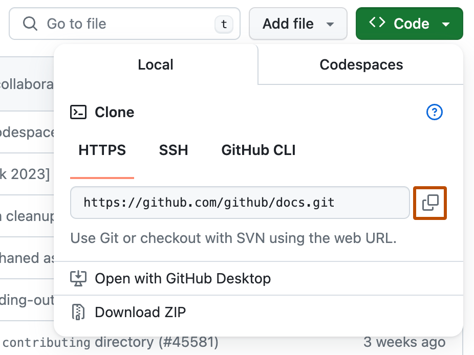
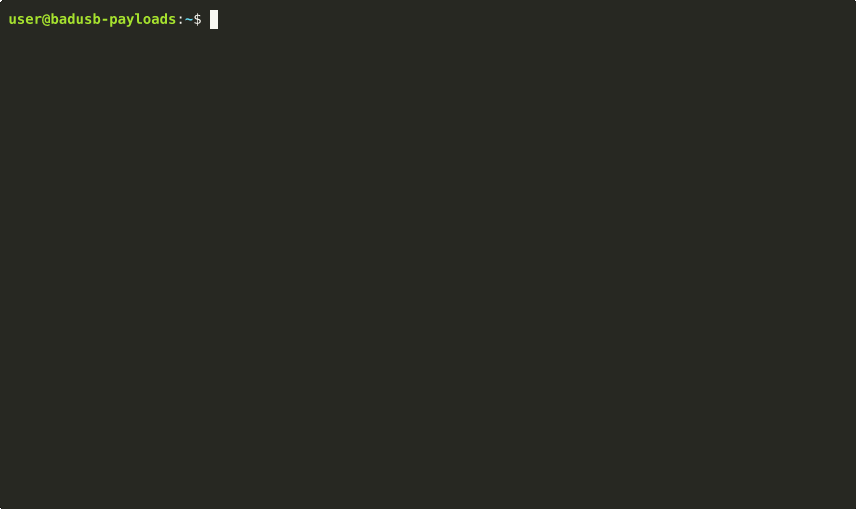

<div align="center">
    <h1>🤓 Bro, can you send me the FAP? 🤓</h1>
    <table>
        <tr align="center">
            <td>Category</td>
            <td>Type</td>
            <td>For</td>
            <td>Target</td>
        </tr>
        <tr align="center">
            <td></td>
            <td></td>
            <td></td>
            <td></td>
        </tr>
    </table>
</div>

This scripts automates FAP build for people who don't know how to do it. Check out the "[How to use it](#-how-to-use-it)" section below to prepare your payload. Once executed, the payload will trigger every command needed to build a FAP application from source code for a specific Flipper's firmware.

> [!IMPORTANT]
> This script is designed to be executed on Unix-like OSes. If you are on Windows, use WSL with a Debian based OS like Ubuntu. Be sure to also have `git` installed locally on the system.

## 💡 Usage
1. Download the payload file locally on your PC from [here](https://raw.githubusercontent.com/cyberartemio/badusb-payloads/refs/heads/main/execution/bro_can_you_send_me_the_fap/payload_for_flipper.txt)
2. Go to line 51 and replace `<...>` with the link of the Github repository of the firmware that you are using
    - **hint:** you can copy the link from one of the comments between lines 46 and 49
3. Go to line 56 and replace `<...>` with the link of the Github repository of the app that you want to compile
    - **hint:** if you don't know where to get the repository link from Github, check the [section below](#how-to-find-the-github-repository-link)
4. Copy the modified payload onto your Flipper SD card. The path is `SD Card/BadUSB/<your payload name>.txt`
5. Close qFlipper if you have it open and any other browser tab using the serial connection to the Flipper
6. Open a terminal
    - **note:** if you are using Windows open a WSL terminal. Powershell/command prompt doesn't work
7. While keeping the focus on your terminal tab, launch the badUSB payload with your Flipper
8. While the toolchain is being downloaded on your PC, **exit from badUSB application on your Flipper**
9. Wait until each commands has been executed

At the end you'll find the `.fap` application in your home directory: `~/<app name>.fap`.

### 🔎 How to find the Github repository link
Open the repository page on Github. Click on the green button `Code` and then copy the URL value in the `HTTPS` tab:

<div align="center">
    
</div>

## 🔥 Showcase
If you want to see the script in action, check the following run where the FAP for [Ghost ESP](https://github.com/Spooks4576/ghost_esp_app) is built for MomentumFW in Debian:

<div align="center">
    
</div>

## 🤖 Commands executed
These are the commands executed by the payload:
```shell
FLIPPER_FW_REPO=<add here the link to the Github repo of Flipper firmware>

FLIPPER_APP_REPO=<add here the link to the Github repo of the app>

cd /tmp; \
git clone $FLIPPER_FW_REPO flipper_fw; \
git clone $FLIPPER_APP_REPO flipper_fw/applications_user/i_want_this_app; \
cd flipper_fw; \
I_WANT_THIS_APP=$(grep 'appid=' applications_user/i_want_this_app/application.fam | sed -E 's/.*appid="([^"]+)".*/\1/'); \
chmod +x fbt; \
./fbt build APPSRC=$I_WANT_THIS_APP; \
./fbt launch APPSRC=$I_WANT_THIS_APP; \
mv $(find build -name $I_WANT_THIS_APP.fap) $HOME; \
cd ..; \
rm -rf flipper_fw; \
find $HOME -name $I_WANT_THIS_APP.fap;
```
